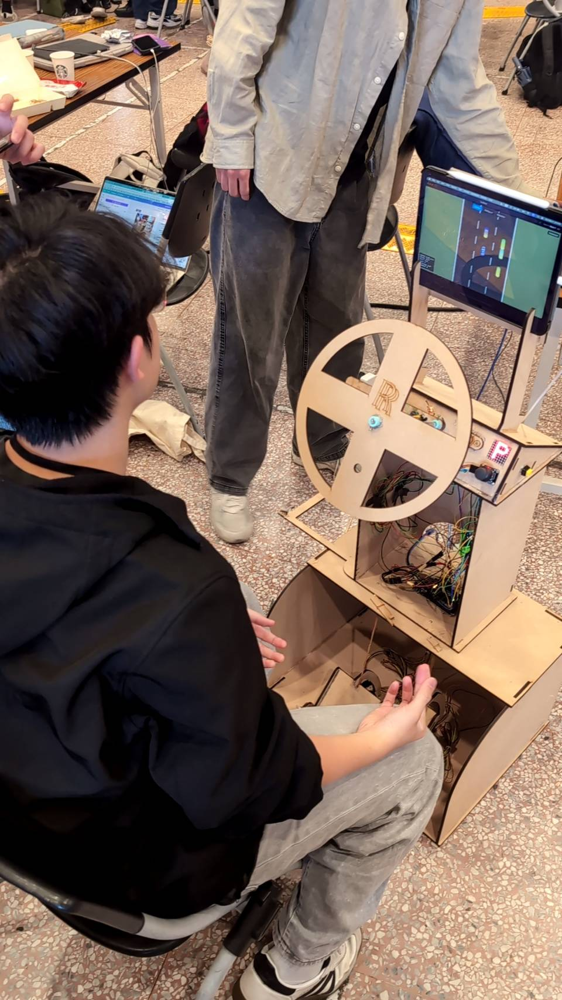
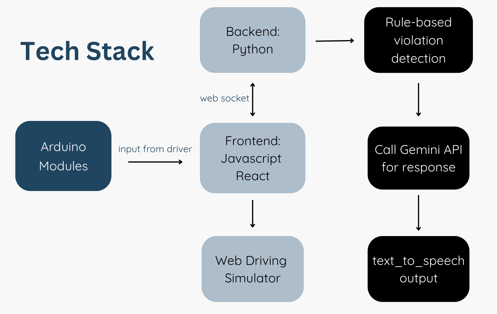
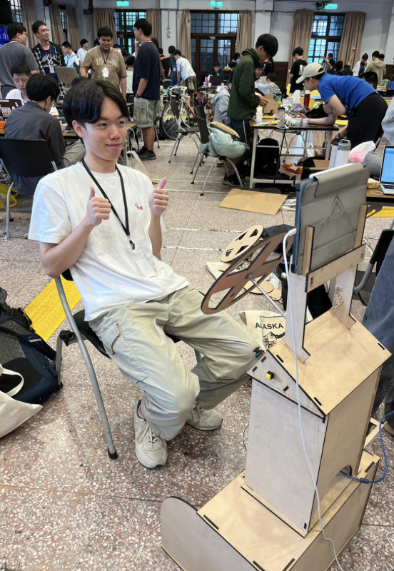
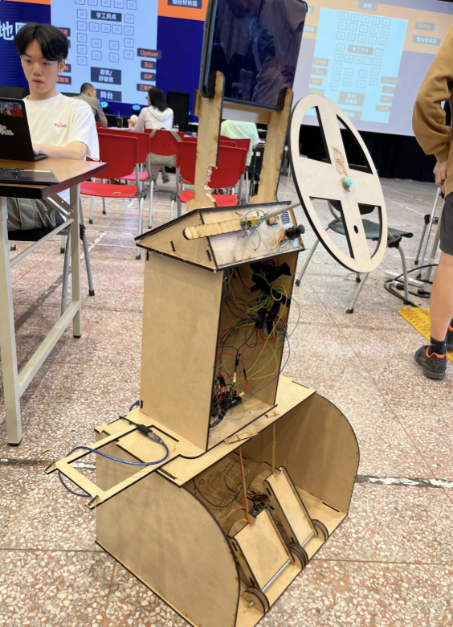

# AI Driving Coach (Ai Cruise Assistant)

Real-time AI driving assistant that combines an Arduino driving rig, a Python simulation backend, and a React frontend to detect risky behavior and generate spoken coaching feedback.

Award: 1st place (AUO Prize), MakeNTU 2025



## Demo

- Project demo / presentation: https://canva.link/6l0bi7b30azhhz7

## Tech Stack Graph



## Final Product Gallery

<p>
  
  
  
</p>

## Tech Stack

- Embedded: Arduino (C/C++)
- Backend: Python (asyncio, websockets, pyserial)
- Frontend: React 18 (Create React App)
- AI + Voice: Google Gemini API + Google Cloud Text-to-Speech
- Data: CSV event logging for post-drive analysis

## What It Does

- Detects unsafe behavior across highway, intersection, and parking scenarios
- Streams simulator state in real time over WebSocket
- Logs driving events with timestamps and context
- Generates spoken corrective feedback in Traditional Chinese

## Quick Start (3 Steps)

1. Install dependencies

```bash
cd driving_simulator/backend && pip install -r requirements.txt
cd ../frontend && npm install
```

2. Set environment variables

```bash
export GOOGLE_API_KEY="YOUR_API_KEY"
export GOOGLE_APPLICATION_CREDENTIALS="/path/to/service-account.json"
```

3. Run backend and frontend

```bash
# Terminal A
cd driving_simulator/backend && python main.py

# Terminal B
cd driving_simulator/frontend && npm start
```

Frontend runs at http://localhost:3000 and connects to ws://localhost:8765.

## Repository Map

- `Arduino/main/`: firmware for joystick, encoder, ultrasonic sensors, turn signals, LED matrix
- `driving_simulator/backend/`: physics, WebSocket server, Arduino bridge, voice feedback
- `driving_simulator/frontend/`: simulator UI and scene rendering
- `software/`: standalone scenario checking and CSV logging scripts

## Team

YuTing Chen, Ryan Chen, Justin Tsai, Yuhan Huang, William Su (NTU CS & EE)

## License

MIT
